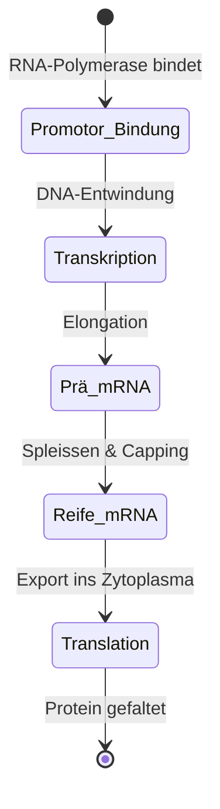
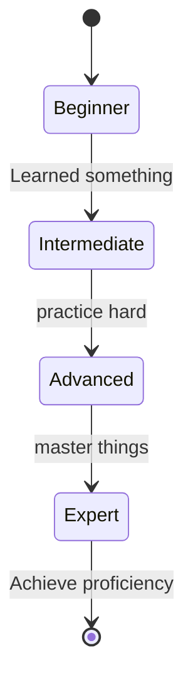
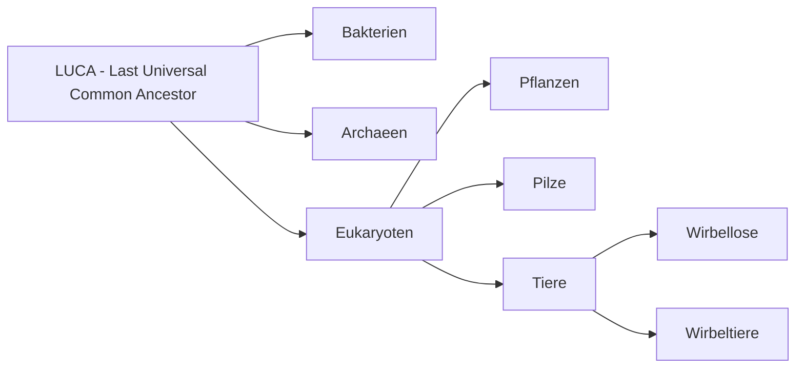
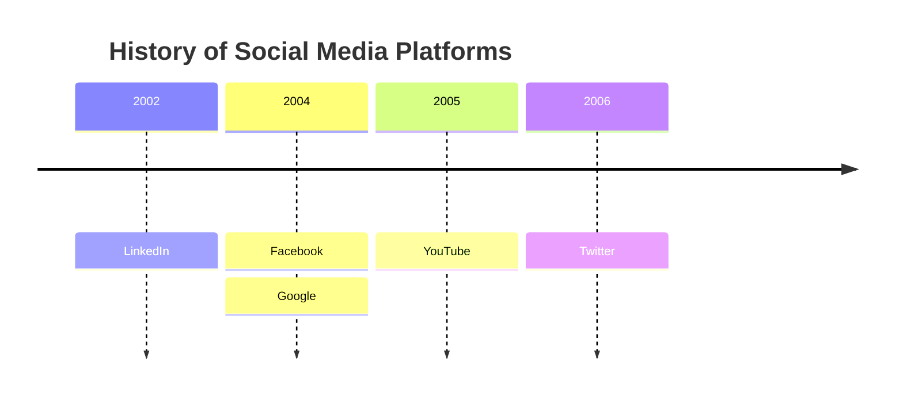

---
cornell-layout:
  pageSize: Letter
  margin: "2"
  headerHeight: "14"
  cuesWidth: "64"
  summaryHeight: "40"
  fontSize: 9pt
  fontFamily: "'Palatino Linotype', 'Book Antiqua', Palatino, serif"
  hideHeaders: true
  solidLine: true
  textWrapping: true
  floatSide: left
  justifiedText: true
  hyphenationLang: de
  codeScale: "0.9"
  mermaidScale: "0.7"
  tableScale: "0.8"
  elementSpacing: "2"
---

# Header 

<div class="cornell-flex-row">
<div>**Date:**
xx-yy-zzzz  | 
</div>
<div>**Class:**
Science 101  | 
</div>
<div>**Topic:**
Some more examples for supported markdown structures
</div>
</div>

You can create your own header style here... and delete the one above! Like this one, visible if you make the header height bigger (in settings) to reveal it.
### *Date:* xx-yy-zzzz  | *Class:* Computer Science 101 | *@Topic:* Some more examples supported Markdown Structures

# Cues 


You can create/modify your own header styles too. 

Top and bottom heights are limited (lower limits is 5mm):


- Top-Limit up to: 80mm ~ 3.15″
	- usually used as header
- Bottom-Limit up to: 100mm ~ 3.94″
	- usually used as summary

#### Chemistry Formulas:


$ \ce{Fe^{II}Fe^{III}2O4} $

$\large \ce{A ->[H2O] B}$

$\large \ce{A-B=C#D}$ chem. bonding

$C_p[\ce{H2O(l)}] = \pu{75.3 J // mol K}$


### Math formula sizing by using standard $\LaTeX$  syntax:
1. `\tiny` – ca. **5–6 pt**
2. `\scriptsize` – ca. **7 pt**
3. `\small` – ca. **9 pt**
4. `\normalsize` – **10–12 pt** (not needed!)
5. `\large` – ca. **12–14 pt**
6. `\Large` – ca. **14–16 pt**
7. `\LARGE` – ca. **17–20 pt**
8. `\huge` – ca. **20–24 pt**
9. `\Huge` – ca. **25–30 pt** in MathJax.


---
Tag-Pills for highlighting keywords:

#chemistry #biology #math #topics

<div class="cornell-flex-row">
<div style="width: 22ch;">

</div>
<div>

</div>
</div>


# Notes %% Notes (record) %%
**Chemical Reaction Equations with mhchem Package:** [mhchem Syntax](https://ftp.snt.utwente.nl/pub/software/tex/macros/latex/contrib/mhchem/mhchem.pdf)
$\large \ce{Zn^2+
<=>[+ 2OH-][+ 2H+]
$\underset{\text{amphoteres Hydroxid}}{\ce{Zn(OH)2 v}}$
<=>[+ 2OH-][+ 2H+]
$\underset{\text{Hydroxozikat}}{\ce{[Zn(OH)4]^2-}}$
}$
%% CC(=O)OC1=CC=CC=C1C(=O)O  C1CCC(C2CNNC2)C1  N[C@@H](C)C(=O)O %%


## Molecules with SMILES:

```smiles|0.55
O=S(C1=NC=2C=C(OC(F)F)C=CC2N1)CC3=NC=CC(OC)=C3OC
```
The molecular formula of Pantoprazol is created with $\LaTeX$ code and the mhchem package: $ \ce{C16H15F2N3O4S}$.

The molecule pic was generated using SMILES notation code. Simply search for "Pantoprazol molecule" online to find the code for both - no need to create it yourself. Copy & paste - it's done! For not so well known molecules ask your LLM of choice.

**For beginners in bioinformatics, chemistry, biology, and medicine:** 
You might wonder why hydrogen atoms (H) are often missing in SMILES notation? Here's the why: SMILES simplifies molecular structures by omitting atoms. While hydrogen is commonly implicit, other atoms like carbon, nitrogen, oxygen, sulfur, halogens, and even metals can also be omitted or simplified. The specific atoms that can be implicit depend on conventions used in the chemical database or software interpreting the notation. Understanding these conventions is crucial for accurately interpreting SMILES strings. Generating SMILES strings for specific molecules isn't always easy, but you can get them online from databases, search engines or you can ask a Large Language Model (LLM) to help. So you really don't have to do it by yourself.
%% ___ %%
___
<div class="cornell-flex-row">
<div style="width: 60ch;">
**5. large-size:**
$$ \large
\frac{\partial u}{\partial t}
 = p^2 \left( \frac{\partial^2 u}{\partial x^2}
+ \frac{\partial^2 u}{\partial y^2} 
+ \frac{\partial^2 u}{\partial z^2} \right)
$$

**6. Large-size:**
$$ \Large
\frac{\partial u}{\partial t}
 = p^2 \left( \frac{\partial^2 u}{\partial x^2}
+ \frac{\partial^2 u}{\partial y^2} 
+ \frac{\partial^2 u}{\partial z^2} \right)
$$

**7. LARGE-size:**
$$ \LARGE
\frac{\partial u}{\partial t}
 = p^2 \left( \frac{\partial^2 u}{\partial x^2}
+ \frac{\partial^2 u}{\partial y^2} 
+ \frac{\partial^2 u}{\partial z^2} \right)
$$
</div>
<div>
**1. Tiny:** 
$$\tiny
\begin{vmatrix}a & b\\
c & d
\end{vmatrix}=(ad-bc)
$$

**2. Script-size:**
 $$\scriptsize
\begin{vmatrix}a & b\\
c & d
\end{vmatrix}=(ad-bc)
$$

**3. Small-size:**$$\small 
\sum_{i=1}^n i^2 = \frac{1}{2} n (n+1)
$$

**4. Standard-size:**
$$
\sum_{i=1}^n i^2 = \frac{1}{2} n (n+1)
$$
</div>
</div>


**8. huge-size:**
$$\huge
\frac{\partial u}{\partial t}
 = p^2 \left( \frac{\partial^2 u}{\partial x^2}
+ \frac{\partial^2 u}{\partial y^2} 
+ \frac{\partial^2 u}{\partial z^2} \right)
$$ 

**9. Huge-size:**
$$\Huge
\frac{\partial u}{\partial t}
 = p^2 \left( \frac{\partial^2 u}{\partial x^2}
+ \frac{\partial^2 u}{\partial y^2} 
+ \frac{\partial^2 u}{\partial z^2} \right)
$$ 
---
<div class="cornell-flex-row">
<div>
> [!custom|#1a20d9] My custom callout heading
> - Lorem ipsum dolor sit  
> 	- consetetur sadipscing elitr 

- 1 custom type (choose Title and color with hex) syntax: **> [!custom|#1a20d9] My custom callout...**
- All 12 basic callout types (not the original Obsidian callout boxes, so with limited functionality) 
</div>
</div>

<div class="cornell-flex-row">
<div>
> [!note] 
> invidunt ut labore et dolore aliquyam erat 

> [!info] 
> invidunt ut labore et dolore aliquyam erat 

> [!tip] 
> invidunt ut labore et dolore aliquyam erat 

> [!success] 
> invidunt ut labore et dolore aliquyam erat 

> [!question] 
> invidunt ut labore et dolore aliquyam erat 

> [!warning] 
> invidunt ut labore et dolore aliquyam erat 
</div>
<div>
> [!abstract] 
> invidunt ut labore et dolore aliquyam erat 

> [!failure] 
> invidunt ut labore et dolore aliquyam erat 

> [!danger] 
> invidunt ut labore et dolore aliquyam erat 

> [!bug] 
> invidunt ut labore et dolore aliquyam erat 

> [!example] 
> invidunt ut labore et dolore aliquyam erat 

> [!quote] 
> invidunt ut labore et dolore aliquyam erat 
</div>
</div>

### Some Mermaid Diagramms:

The [syntax](https://mermaid.js.org/intro/) is quite easy to learn, but there are also graphical tools available and of course LLM's. 
Several software tools offer a **graphical user interface (GUI)** for creating Mermaid diagrams and exporting them as Mermaid code: **Mermaid Flow**, **Mermaid Chart**, **Miro** and **Eraser**

%% ___ %%

<div class="cornell-flex-row">
<div>

</div>
<div>

</div>
</div>

# Summary %% Notes (reflect & review) %%

Lorem ipsum dolor sit amet, consetetur sadipscing elitr, sed diam nonumy eirmod tempor invidunt ut labore et dolore magna aliquyam erat, sed diam voluptua. Stet clita kasd gubergren, no sea takimata sanctus est Lorem ipsum dolor sit amet. Lorem ipsum dolor sit amet, consetetur sadipscing elitr, sed diam nonumy eirmod tempor invidunt ut labore et dolore magna aliquyam erat, sed diam voluptua.

