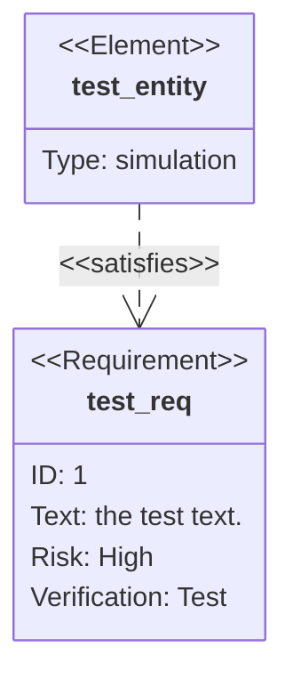
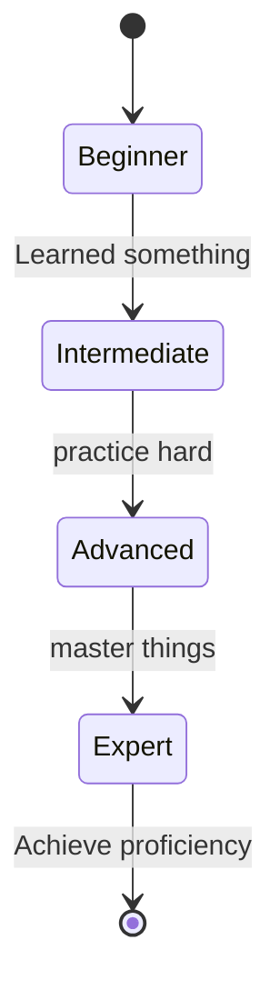
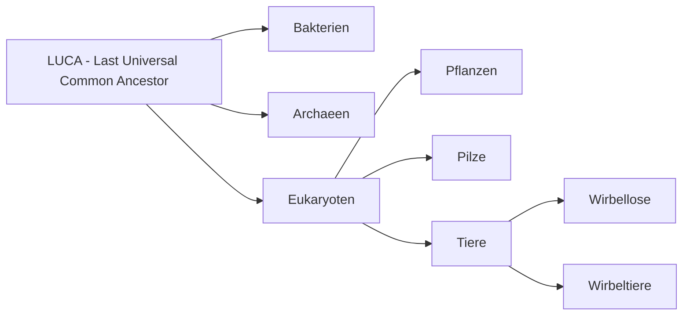
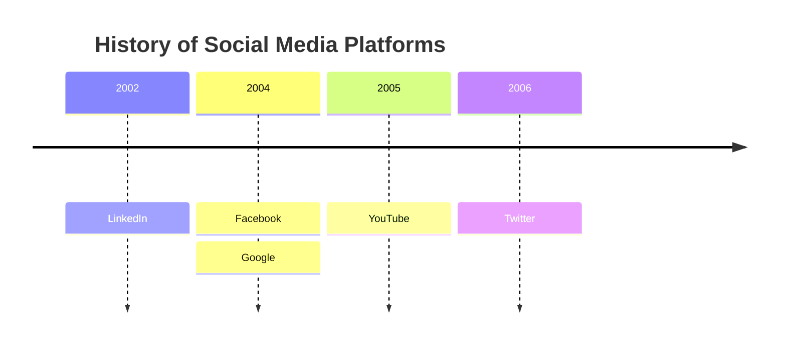

---
cornell-layout:
  pageSize: Letter
  margin: "2"
  headerHeight: "13"
  cuesWidth: "64"
  summaryHeight: "40"
  fontSize: 9pt
  fontFamily: "'Palatino Linotype', 'Book Antiqua', Palatino, serif"
  hideHeaders: true
  solidLine: true
  textWrapping: true
  floatSide: left
  justifiedText: true
  hyphenationLang: de
  codeScale: "0.9"
  mermaidScale: "0.7"
  tableScale: "0.8"
  elementSpacing: "2"
---

# Header 

<div class="cornell-flex-row">
<div>**Date:**
xx-yy-zzzz
</div>
<div>**| Class:**
| Science 101
</div>
<div>**| Topic:**
| Some more examples for supported markdown structures [Letter format]
</div>
</div>

You can create your own header style here... and delete the one above! Like this one, it gets visible if you make the header height bigger (in settings) to reveal it at sthis stage.
### *Date:* xx-yy-zzzz  | *Class:* Computer Science 101 | *@Topic:* Some more examples supported Markdown Structures


# Cues 


You can create/modify your own header styles too. 


Top and bottom heights are limited (lower limits are 5mm):


- Top height limit: 80mm ~ 3.15″
	- usually used as header
- Bottom height limit: 100mm ~ 3.94″
	- usually used as summary

#### Chemistry Formulas:


$ \ce{Fe^{II}Fe^{III}2O4} $

$\large \ce{A ->[H2O] B}$

$\large \ce{A-B=C#D}$ chem. bonding

$C_p[\ce{H2O(l)}] = \pu{75.3 J // mol K}$


### Math formula sizing by using standard $\LaTeX$  syntax:
1. `\tiny` – ca. **5–6 pt**
2. `\scriptsize` – ca. **7 pt**
3. `\small` – ca. **9 pt**
4. `\normalsize` – **10–12 pt** (not needed!)
5. `\large` – ca. **12–14 pt**
6. `\Large` – ca. **14–16 pt**
7. `\LARGE` – ca. **17–20 pt**
8. `\huge` – ca. **20–24 pt**
9. `\Huge` – ca. **25–30 pt** in MathJax.


---
Tag-Pills for highlighting keywords:

#chemistry #biology #math #topics

<div class="cornell-flex-row">
<div style="width: 30ch;">

</div>
<div>

</div>
</div>

# Notes %% Notes (record) %%
**Chemical Reaction Equations with mhchem Package:** [mhchem Syntax](https://ftp.snt.utwente.nl/pub/software/tex/macros/latex/contrib/mhchem/mhchem.pdf)
$\large \ce{Zn^2+
<=>[+ 2OH-][+ 2H+]
$\underset{\text{amphoteres Hydroxid}}{\ce{Zn(OH)2 v}}$
<=>[+ 2OH-][+ 2H+]
$\underset{\text{Hydroxozikat}}{\ce{[Zn(OH)4]^2-}}$
}$
%% CC(=O)OC1=CC=CC=C1C(=O)O  C1CCC(C2CNNC2)C1  N[C@@H](C)C(=O)O %%


## Molecules with SMILES:

```smiles|0.55
O=S(C1=NC=2C=C(OC(F)F)C=CC2N1)CC3=NC=CC(OC)=C3OC
```
The molecular formula of Pantoprazole: $ \ce{C16H15F2N3O4S}$ is created with $\LaTeX$ code. The molecule picture was made using SMILES notation code. 
To get codes for both use a search engine with terms: "Pantoprazole SMILES" and "Pantoprazole mhchem LaTeX". It's much faster and more accurate then to create it yourself. Copy & paste - it's done! For not so well known molecules ask an LLM to generate it.
**A hint for beginners in bioinformatics, chemistry, biology and medicine:** 
Counting atoms in molecular formula and comparing numbers within SMILES pics and code you might ask: Why are atoms like hydrogen (H) or carbon (C) often missing? Here's why: SMILES simplifies molecular structures by omitting atoms. **In short, "missing atoms" in SMILES code from chemical databases and pictures are not errors – they are  simplifications based on well-defined chemical rules and conventions**. These apply to other atoms too: nitrogen, oxygen, sulfur, halogens and even metals as well. All depends on conventions used in chemical databases or software interpreting the notation. Without support, knowing these conventions would be crucial for accurately interpreting or creating SMILES strings. But getting the code online from [databases](https://pubchem.ncbi.nlm.nih.gov/#query=pantoprazole), AI (LLM's) or search engines is 99% reliable. So even as an early stage student, middle schooler or interested noob you might not be familiar with those rules, but you can still get your beautiful Cornell notes done.
%% ___ %%
___

<div class="cornell-flex-row">
<div style="width: 60ch;">
**5. large-size:**
$$ \large
\frac{\partial u}{\partial t}
 = p^2 \left( \frac{\partial^2 u}{\partial x^2}
+ \frac{\partial^2 u}{\partial y^2} 
+ \frac{\partial^2 u}{\partial z^2} \right)
$$

**6. Large-size:**
$$ \Large
\frac{\partial u}{\partial t}
 = p^2 \left( \frac{\partial^2 u}{\partial x^2}
+ \frac{\partial^2 u}{\partial y^2} 
+ \frac{\partial^2 u}{\partial z^2} \right)
$$

**7. LARGE-size:**
$$ \LARGE
\frac{\partial u}{\partial t}
 = p^2 \left( \frac{\partial^2 u}{\partial x^2}
+ \frac{\partial^2 u}{\partial y^2} 
+ \frac{\partial^2 u}{\partial z^2} \right)
$$
</div>
<div>
**1. Tiny:** 
$$\tiny
\begin{vmatrix}a & b\\
c & d
\end{vmatrix}=(ad-bc)
$$

**2. Script-size:**
 $$\scriptsize
\begin{vmatrix}a & b\\
c & d
\end{vmatrix}=(ad-bc)
$$

**3. Small-size:**$$\small 
\sum_{i=1}^n i^2 = \frac{1}{2} n (n+1)
$$

**4. Standard-size:**
$$
\sum_{i=1}^n i^2 = \frac{1}{2} n (n+1)
$$
</div>
</div>


**8. huge-size:**
$$\huge
\frac{\partial u}{\partial t}
 = p^2 \left( \frac{\partial^2 u}{\partial x^2}
+ \frac{\partial^2 u}{\partial y^2} 
+ \frac{\partial^2 u}{\partial z^2} \right)
$$ 

**9. Huge-size:**
$$\Huge
\frac{\partial u}{\partial t}
 = p^2 \left( \frac{\partial^2 u}{\partial x^2}
+ \frac{\partial^2 u}{\partial y^2} 
+ \frac{\partial^2 u}{\partial z^2} \right)
$$ 
---
<div class="cornell-flex-row">
<div>
> [!custom|#1a20d9] My custom callout heading
> - Lorem ipsum dolor sit  
> 	- consetetur sadipscing elitr 

- 1 custom type (choose Title and color with hex) syntax: **> [!custom|#1a20d9] My custom callout...**
- All 12 basic callout types (not the original Obsidian callout boxes, so with limited functionality) 
</div>
</div>

<div class="cornell-flex-row">
<div>
> [!note] 
> invidunt ut labore et dolore aliquyam erat 

> [!info] 
> invidunt ut labore et dolore aliquyam erat 

> [!tip] 
> invidunt ut labore et dolore aliquyam erat 

> [!success] 
> invidunt ut labore et dolore aliquyam erat 

> [!question] 
> invidunt ut labore et dolore aliquyam erat 

> [!warning] 
> invidunt ut labore et dolore aliquyam erat 
</div>
<div>
> [!abstract] 
> invidunt ut labore et dolore aliquyam erat 

> [!failure] 
> invidunt ut labore et dolore aliquyam erat 

> [!danger] 
> invidunt ut labore et dolore aliquyam erat 

> [!bug] 
> invidunt ut labore et dolore aliquyam erat 

> [!example] 
> invidunt ut labore et dolore aliquyam erat 

> [!quote] 
> invidunt ut labore et dolore aliquyam erat 
</div>
</div>

### Some Mermaid Diagramms:

The [syntax](https://mermaid.js.org/intro/) is quite easy to learn, but there are also graphical tools available and of course LLM's. 
Several software tools offer a **graphical user interface (GUI)** for creating Mermaid diagrams and exporting them as Mermaid code: **Mermaid Flow**, **Mermaid Chart**, **Miro** and **Eraser**

%% ___ %%

<div class="cornell-flex-row">
<div>

</div>
<div>

</div>
</div>


# Summary %% Notes (reflect & review) %%

Lorem ipsum dolor sit amet, consetetur sadipscing elitr, sed diam nonumy eirmod tempor invidunt ut labore et dolore magna aliquyam erat, sed diam voluptua. Stet clita kasd gubergren, no sea takimata sanctus est Lorem ipsum dolor sit amet. Lorem ipsum dolor sit amet, consetetur sadipscing elitr, sed diam nonumy eirmod tempor invidunt ut labore et dolore magna aliquyam erat, sed diam voluptua.

