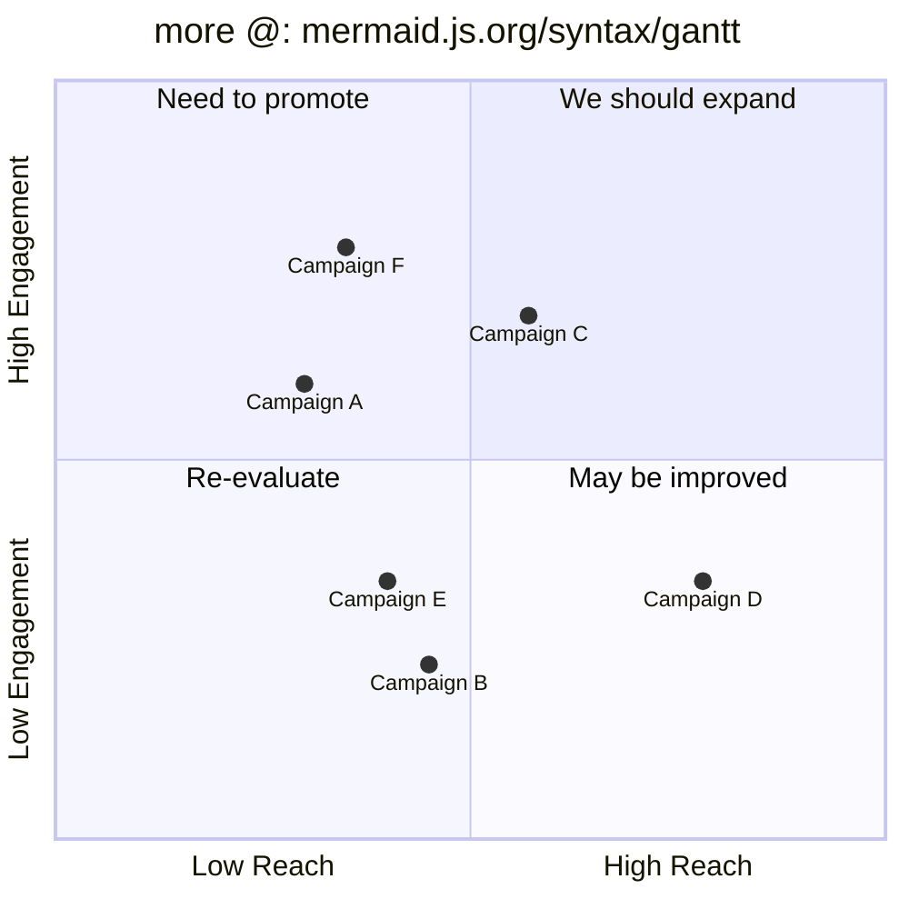

# Header 
## *Date:* xx-yy-zzzz  | *Class:* Computer Science 101 | *@Topic:* US Letter, with Objects neighboring

# Cues 


# Notes 

<div style="display: flex; gap: 5px; align-items: flex-start;">
**Script-size:** $$\scriptsize
\begin{vmatrix}a & b\\
c & d
\end{vmatrix}=(ad-bc)
$$

![[BMP_Image.bmp|225]]

| Math Formulas | Pictures | Mermaid Diagrams | Codeblocks |
| ----------------: | --------- | --------------------- | :-----------: |
| LaTeX         | 5 types  |  different types | syntax highlighting |
| + inline      | + .gif     |  mermaid.js.org |                                | 
</div>

<div style="display: flex; gap: 3px; align-items: flex-start;">

```java
public class TreeNode<T> {
    T data;
    TreeNode<T> left;
    TreeNode<T> right;
    
    public TreeNode(T data) {
        this.data = data;
        this.left = null;
        this.right = null;
    }
}
```

And positioning some text next to 
the two objects. For optimal use of 
space.

So let's look if it sums up to you: 
$\sum_{i=1}^n i^2 = \frac{1}{2} n (n+1)$

</div>

<div style="display: flex; gap: 0px; align-items: flex-start;">
![[PNG_Image.png|184]]
![[JPG_Image.jpg|184]]
![[Animation.gif|190]]
</div>

<div style="display: flex; gap: 10px; align-items: flex-start;">
**Pic_1:** You can do it with  
a text too! You've got to try.
**Pic_2:** Just some more text. 
The alignment is more difficult!
**Pic_3:** It's not perfect, but in the 
end it will work most of the time.
</div>

- Finetuning sizes of: pics, tables, formulas, diagrams make layouts look quite good. 
- Just with convenient input methods (buttons, sliders, shortcuts) or using standard Obsidian Syntax and the necessary code will appear in the markdown file at the right place. 


# Summary 
<div style="display: flex; gap: 10px; align-items: flex-start;">

**Sum_A:** Lorem ipsum dolor sit amet, consetetur sadipscing elitr, sed 
diam nonumy tempor invidunt ut labore et dolore magna 
aliquyam erat, sed diam voluptua. At vero eos et accusam 
et justo duo dolores et ea rebum. Stet clita kasd gubergren, 
no sea takimata sanctus est. Lorem ipsum dolor sit amet. 
Lorem ipsum dolor sit amet, consetetur sadip.

**Sum_B:** Lorem ipsum dolor sit amet, consetetur sadipscing elitr, 
sed diam nonumy eirmod tempor invidunt ut labore et 
dolore magna aliquyam erat, sed diam voluptua. At vero 
eos et accusam et justo duo dolores et ea rebum. Stet 
clita kasd gubergren, no sea takimata sanctus est Lorem 
ipsum dolor sit amet. Lorem ipsum dolor sit amet, 
consetetur sadipscing elitr, magna aliquyam erat, sed 
diam voluptua.
</div>
